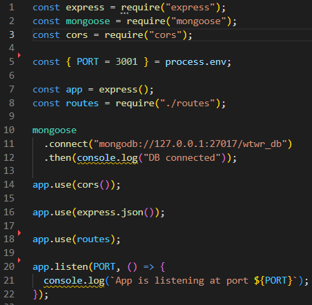
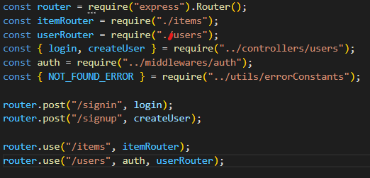
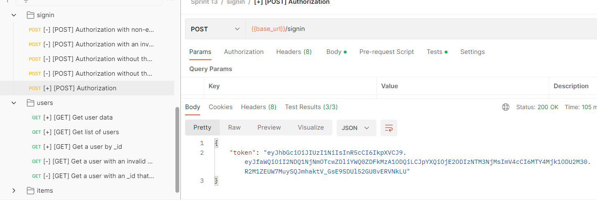

# WTWR (What to Wear?): Back End

## Created an API for use with my WTWR (What to Wear?) project:

The goal of this project was to set up an API for use with my WTWR project to keep track of users and items associated with said users.

## Worked with MongoDB database:

### Non-realtional database:

MongoDB is a non-relational database (uses a heirarchical structure). It makes it easy to assign ID numbers to items in the database, and makes for a more fluid style of storage than relational databases such as MySQL.

### Less Code:

MongoDB allows for data to be manupulated through a user interface and can save on the amount of code needed as compared to a typical relational database.

## User Authentication and Authorization:

Routes were protected with authorization and authentication to ensure correct user permissions.

## Consolidated Error Handling:

A generic error handling function was created to reduce the need for repeating code.

## Postman:

Postman was used to test functionallity of the server.
